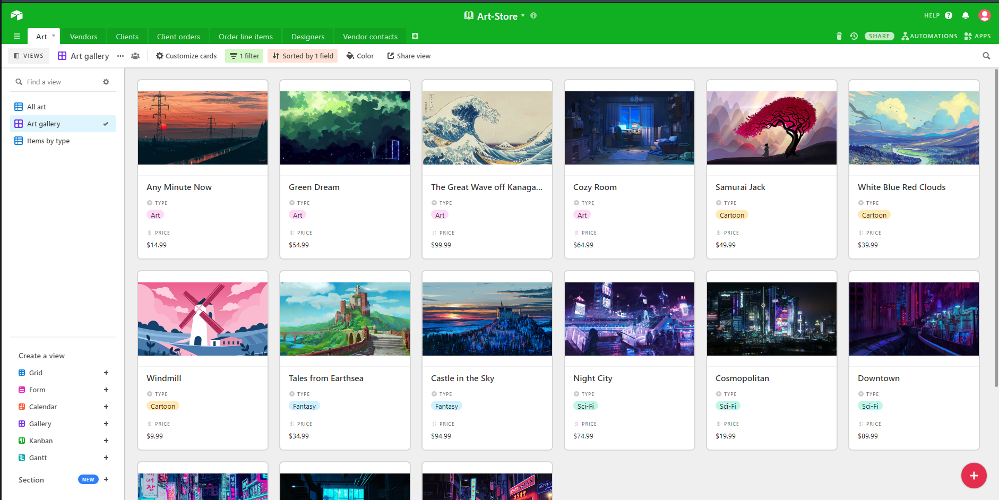

# Proj-Art-House_JS-Master
Master-Project-Art-House
Building a project to fully apply everything learned in JavaScript. Also learned to use Airtable bases, Postman and more Bootstrap 4.

## AWS CDN Link and rest

This is the bucket's direct Endpoint "http://project-art-store-master.s3-website.ap-south-1.amazonaws.com" which is blocked. CDN link is below:

CDN - "https://d1vduo4iat34cx.cloudfront.net"

Learned how to:

1.) Apply all Javascript functionality to a website

2.) Learned Airtable Bases and how to use the database with Airtable's API

3.) More practice on Bootstrap 4, Postman 

(All used AWS services expire around end of 2021 for this project)

## The Airtable Data "Base" setup 

## A clearer and cleaner view of the item cards for each item setup in database being called and targetted using Airtable API

